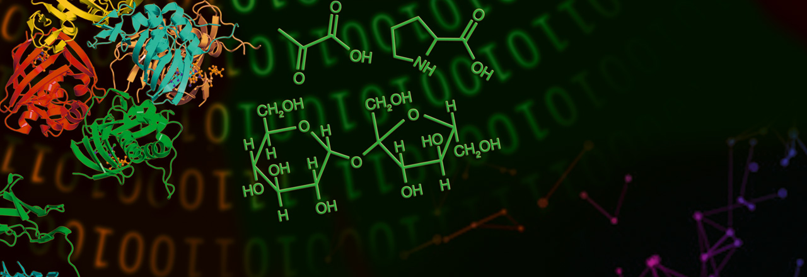

# 
Workshop at the 36th Conference on Neural Information Processing Systems

# 
Friday, December 9, 2021

# About

Omics data (genomics, transcriptomics, proteomic, metabolomics, etc) is high dimensional and rich in information, but extracting and integrating biologically relevant signals is a task complicated by the multiplicity of parallel, redundant and degenerate overlapping biological processes taking place at any given time. The lack of well developed methodologies addressing this challenge is a strong limiting factor for biological knowledge discovery and patient treatment. 

The aim of this workshop will therefore be to explore and propose innovative solutions to the technical challenges inherent to the signal extraction and integration of high dimensional, scarce and complex biological data, as well as propose a guideline for researchers in the field. We aim to foster a collaborative, multi-disciplinary approach, combining expertise across disciplines by bringing together researchers from a wide range of backgrounds and approaches, to discuss and debate on the challenges, problems and the solutions to address them. 

# Topics

- Processing multi-omics data – techniques and challenges (e.g., data scarcity, dimensionality reduction, signal extraction, etc.).
- Omics data fusion – dealing with different data types and their integration, such as imaging/video, and omics.
- Innovative machine learning methods applied to multi-omics data – supervised, semi-supervised and unsupervised approaches.
- Graph-based methods applied to multi-omics data   – multiplex networks, low dimensional embeddings, etc. 
- Knowledge discovery – understanding and discovering underlying biological processes and treatment targets through multi-omics data.
- Translation to the clinic – moving from research to application, how should patient stratification tools best be used in clinical practice

# Call for Posters

Early Career Researcher

# Invited Speakers

- Olivier Gevaert
- Mireia Crispin Ortuzar
- Richard J. Chen

# Schedule

- 09.00 - Welcome and Introductory remarks
- 09.30 - Keynote 1
- 10.00 - Q&A Keynote 1
- 10.30 - Invited Talk 1
- 10.45 - Q&A Invited Talk 1
- 11.00 - Invited Talk 2
- 11.15 - Q&A Invited Talk 2
- 11.30 - Coffee Break
- 12.00 - Panel Discussion
- 13.00 - Lunch Break
- 13.30 - Welcome back
- 13.45 - Keynote 2
- 14.15 - Q&A Keynote 2
- 14.45 - Invited Talk 3 
- 15.00 - Q&A Invited Talk 3
- 15.15 - Coffee Break
- 15.30 - Problem solving session
- 17.00 - Coffee Break
- 17.10 - Best Poster Presentation** (10 min presentation + 10 min Q&A)
- 17.30 - Runner-up Poster Presentation (10 min presentation + 10 min Q&A)
- 17.50 - Closing Remarks
- 18.00 – 19.30 - Poster Presentations

# Organising Committee

**Sara Masarone** 

Sara Masarone is a PhD student at The Alan Turing Institute and Queen Mary University of London. Her work focuses on the use of data-driven methods and Machine Learning to understand the hyperacute window of trauma patients. Recently, she has worked on biomarkers identification as well as Representation Learning as a method to harmonise different datasets to improve data quality. 

Website: https://saramasarone.github.io \
Contacts: smasarone@turing.ac.uk, s.masarone@qmul.ac.uk \
Affiliation: The Alan Turing Institute and Queen Mary University of London

**Amaya Gallagher- Syed** 

Amaya is a Wellcome Trust PhD student based at Queen Mary University of London. Her work focuses on multi-omic data integration, histopathology imaging and deep learning fusion models applied to autoimmune diseases. She is particularly interested in techniques extracting low dimensional embeddings of high dimensional data. 
 
Contacts: a.r.syed@qmul.ac.uk \
Affiliation: Queen Mary University of London 

# Programme Committee

- Olivier Gevaert
- Mireia Crispin Ortuzar
- Elsa Angelini
- Greg Slabaugh
- Andrew Holding
- Alejandro Frangi
- Harlin Lee
- Reza Khorshidi
- Christopher Yau
- Faisal Mhammood

### Support or Contact
You can contact us at: neurips.modif@gmail.com 
